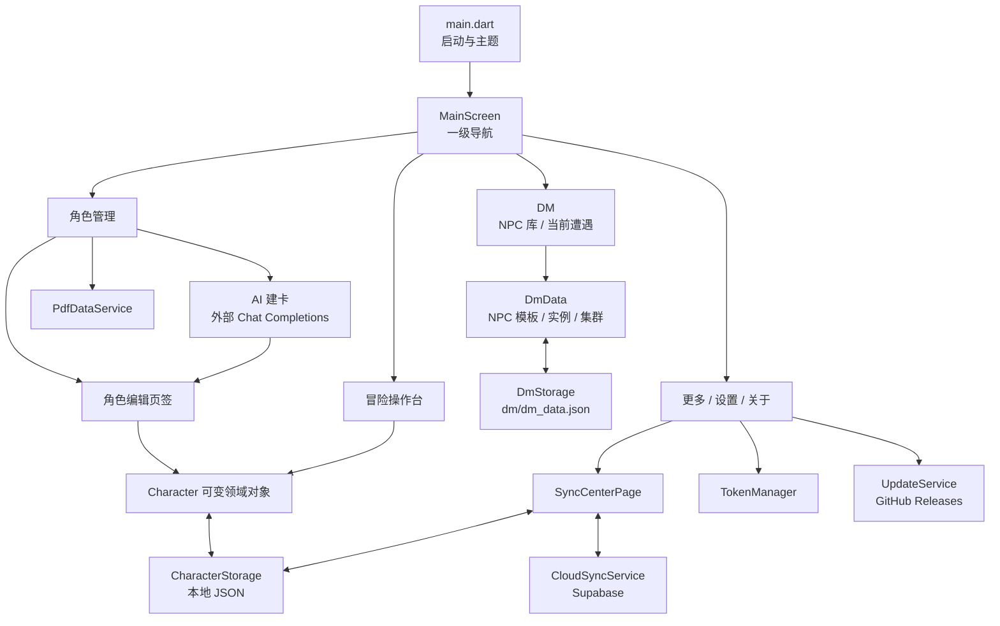

# 总体架构

## 架构概览

项目采用轻量的 Flutter 单体应用结构：Widget 直接持有页面状态和可变的 `Character` 对象，服务类负责文件、云端、PDF、令牌、AI 和更新等边界能力。除用于隔离 AI 配置元数据与安全密钥的 `AiConfigRepository` 外，当前没有通用 repository 层、依赖注入容器或全局状态管理框架。



## 目录职责

| 目录/文件 | 职责 |
| --- | --- |
| `lib/main.dart` | 初始化 Flutter、预热带令牌的云客户端、启动 UI、异步检查更新 |
| `lib/models/` | 角色领域模型、AI 草稿/配置类型和 JSON 生成代码 |
| `lib/models/dm_models.dart` | NPC 卡、分类、实例快照、集群和唯一当前遭遇模型 |
| `lib/pages/` | 页面、路由和页面内状态 |
| `lib/pages/dm/` | DM 二级导航、NPC 库/编辑器、分类管理和当前遭遇 UI |
| `lib/pages/tabs/` | 角色编辑的五个领域页签 |
| `lib/pages/sync/` | 当前云端备份页及已废弃 LAN 页面 |
| `lib/services/` | 文件、PDF、云端、令牌、AI 配置/请求、更新、全局 SnackBar 等边界服务 |
| `lib/services/dm_storage.dart`、`dm_rules.dart` | 独立 DM 本地文件和可测试的通用掷骰选择规则 |
| `lib/widgets/` | 跨页面复用的 UI 组件与响应式断点 |
| `lib/theme/` | Material 3 浅色/深色主题和语义色 |
| `assets/` | PDF 模板、许可、字体和图标 |
| `test/` | Widget、云端解析和 PDF 图片测试 |

## 启动流程

1. `WidgetsFlutterBinding.ensureInitialized()`。
2. 从 `SharedPreferences` 读取身份令牌。
3. 如令牌存在，构造带 `x-sync-token` 请求头的 `SupabaseClient`；失败被静默忽略。
4. 构建 `DnDToolkitApp`，主题跟随系统浅色/深色模式。
5. `runApp` 后异步调用 GitHub Release 更新检查。
6. 首屏为 `MainScreen` 的角色管理页。

云端客户端的“预热”主要是构造客户端，不应成为本地启动的硬依赖。

## 导航与页面生命周期

一级页面是角色、冒险、DM、更多：

- 宽度小于 720 logical pixels：底部 `NavigationBar`。
- 宽度不小于 720：左侧 `NavigationRail`。

一级页面切换没有使用 `IndexedStack`。旧页面会 `dispose`，新页面重新创建，从而在再次进入角色或冒险页时重新读取本地数据。改变这一点会影响数据刷新和冒险页离开时的自动保存，必须谨慎评估。

## 状态管理

当前模式：

- 页面用 `StatefulWidget` 和 `setState` 管理局部状态。
- `Character` 及其子对象是可变对象，表单直接修改字段。
- 角色编辑页只在“保存并退出”时写入磁盘；离开时检测序列化前后差异并提示。
- 冒险页操作同一个已加载角色对象，在部分操作后立即保存，并在页面销毁或应用进入后台/非活动状态时保存。
- 冒险页最近选择的角色 ID 使用 `SharedPreferences` 记忆；角色列表可以通过 `MainScreen` 回调切换到冒险页并一次性指定初始角色。
- `UpdateService` 是 `ChangeNotifier` 单例，用于传播更新红点。
- `CloudSyncService` 和 `TokenManager` 是惰性单例。

如未来引入统一状态管理，应通过 ADR 说明迁移边界，避免一半页面使用新体系、一半继续直接修改模型。

## 主要数据流

### 角色编辑

```text
本地 JSON → CharacterStorage.loadAllCharacters
            → 角色列表 → CharacterEditPage
            → 用户修改可变 Character
            → CharacterStorage.saveCharacter
            → 更新时间并写入 <id>.json
```

### 冒险操作

```text
本地 JSON + 最近角色 ID → 冒险页选择角色
          → 修改 HP / 生命骰 / 钱币 / 法术位
          → 即时保存或页面/应用生命周期保存
```

骰子日志只存在于当前 `AdventurePage` 实例内，不进入 `Character`，也不持久化。专用死亡豁免的成功/失败使用 `CombatStats` 既有字段持久化，自然 20 会恢复 1 点当前 HP；其最近骰面仍只存在于页面会话。

### DM 本地闭环

```text
dm/dm_data.json → DmStorage → DmData
  → NPC 库创建/编辑模板与分类
  → 实例化时复制 CardSnapshot
  → 当前遭遇修改 HP / 临时 HP / 先攻 / 集群
  → 每次操作及页面/应用生命周期保存
```

DM 通用掷骰日志只存在于当前 `CurrentEncounterView` 页面会话，不进入 `DmData`。当前遭遇始终只有一个；NPC 模板、实例和集群不复用 `Character` JSON，也不进入现有 Supabase `characters` 表。

### 云端备份

```text
SharedPreferences token → x-sync-token header
本地 Character → 去除 PortraitBase64 → Supabase characters.data
Supabase data → Character → 合并本机同 ID 画像 → 本地 JSON
```

### PDF

```text
选择专用 PDF → 按 AcroForm 字段名读取 → 新 Character → 本地 JSON
本地 Character → 填充内置 Character.pdf → Windows 保存 / Android 分享
```

## 依赖方向

期望方向为：

```text
pages/widgets → models
pages         → services
services      → models + 外部 package
models        → json_annotation/uuid
theme         → Flutter Material
```

服务不应依赖具体页面。当前 `LanSyncService` 依赖 `SnackBarService`，但它已废弃，不应作为新代码范例。

## 外部依赖边界

- `path_provider`：应用文档与临时目录。
- `image_picker`：角色画像选择。
- `file_picker`：PDF 选择及 Windows 保存对话框。
- `syncfusion_flutter_pdf`：PDF AcroForm 和画像处理。
- `share_plus`：Android PDF 分享。
- `supabase`：PostgREST 云端数据访问。
- `shared_preferences`：身份令牌。
- `http`、`pub_semver`、`package_info_plus`：GitHub 更新检查。
- `url_launcher`：打开下载页和项目主页。
- `json_serializable`、`build_runner`：模型序列化代码生成。

## 已知结构性风险

- `adventure_page.dart` 和 `pdf_data_service.dart` 体积很大，UI、规则计算和数据操作耦合，修改回归面较宽。
- 没有 schema version 或显式迁移层，模型变化容易破坏真实用户数据。
- 本地文件写入不是临时文件替换式原子写入，也没有自动备份。
- `CharacterStorage` 不能把坏文件列表返回 UI，尚不能完成目标中的用户提示。
- 云端冲突依赖客户端生成的时间，设备时钟偏差会影响“谁更新”的判断。
- PDF 测试依赖开发者个人绝对路径，无法作为稳定 CI 基线。

这些风险应优先通过小步重构、契约测试和 ADR 处理，不应在无关功能中进行大范围架构替换。
