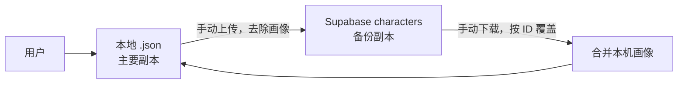

# 数据存储与云端备份

## 数据所有权与主副本

本地 JSON 是角色数据的主要副本。Supabase 是用户主动操作的备份空间，不提供后台同步、实时同步、多人共享或账户恢复。



## 本地存储

`CharacterStorage` 使用 `path_provider.getApplicationDocumentsDirectory()` 获取平台应用文档目录，并直接在该目录存放：

```text
<application documents>/<Character.id>.json
```

DM 功能使用独立的 `DmStorage`，保存到：

```text
<application documents>/dm/dm_data.json
```

该文件根对象以 `DnDToolkit-DM: 2` 标识内部 schema，并同时保存 NPC 分类、NPC 卡和唯一当前遭遇。版本 1 文件仍可读取，加载时会补齐不可删除的默认分类并按属性值重算六维调整值。实例包含创建时的完整 `CardSnapshot`，因此模板后续修改或删除不会影响遭遇实例。DM 读写在所有页面实例间串行执行，保存先写同目录临时文件再替换正式文件，避免响应式页面重建时读取半写入 JSON。DM 数据目前只保存在本地，不进入角色云备份或 PDF。Markdown 只交换用户明确导出的单张 NPC 卡模板，不是 `dm_data.json` 的副本，也不包含分类 ID、实例、动态 HP、先攻、集群或遭遇状态。解析失败时 DM 页面提示并保留原文件。

### 保存

- 默认在保存前将 `updatedAt` 设置为 `DateTime.now().toUtc()`。
- JSON 使用 UTF-8 字符串和 `jsonEncode(character.toJson())`。
- 云端下载后的保存使用 `touchUpdatedAt: false`，保留云端时间用于后续冲突比较。
- 当前写入直接覆盖目标文件，不是临时文件完成后再 rename 的原子写入，也没有历史备份。

### 加载

- 同步枚举应用文档目录中的全部实体，只处理 `.json` 文件。
- 根 JSON 必须是对象。
- `Id` 必须是非空字符串，并且至少包含 `Profile`、`Attributes`、`Combat`、`Proficiencies`、`Roleplay` 或 `Spellbook` 之一。
- 单个文件解析失败时跳过并继续读取其他角色。
- 当前错误只写入 `stderr`；产品目标要求把失败文件提示给用户，这是尚未实现的差距。

### 删除

删除只移除本地 `<id>.json`，不可撤销，也不会删除同一角色的云端备份。

## 兼容和迁移政策

项目已有小规模真实用户，数据兼容属于硬性要求：

- 新版本必须尽可能读取旧 JSON。
- 新字段必须提供默认值。
- 已发布字段不得无迁移地改名、删除或改变类型。
- 损坏文件应提示并跳过，不影响其他角色。
- 迁移失败时应保留原文件，不能先覆盖后报告失败。
- 增加 schema version 后，无版本文件应按 legacy v0 处理。

建议迁移流程：

```text
读取原始文本 → 解析 Map → 识别版本 → 复制原文件/保留原文
→ 逐版本迁移 Map → Character.fromJson → 校验 → 原子保存新格式
```

## 身份令牌

项目不使用 Supabase Auth。身份令牌是客户端生成的 UUID v4，并通过 `SharedPreferences` 的 `cloud_sync_token` 键持久化。

- 请求头：`x-sync-token: <UUID v4>`。
- 设置页通过“云端备份 > 身份令牌”二级页面提供生成、查看、复制、手工输入和替换令牌。
- 输入令牌必须匹配标准 UUID v4 格式。
- 令牌是 bearer secret：知道令牌即可访问对应数据。
- 没有密码、邮箱、找回或服务端恢复流程。
- 生成新令牌不会迁移或删除旧令牌下的数据。
- 更换或重新生成已有令牌前，页面要求用户确认已经保存当前令牌；取消或保存失败时保留原令牌。
- `SharedPreferences` 不是安全硬件或加密凭据库；文档不得把它描述为强安全存储。

令牌示例必须使用明显虚构值，不得提交真实用户令牌。

## AI 服务配置与密钥

AI 服务配置不进入角色 JSON，也不上传到 Supabase。配置元数据以 UUID 为主键保存在 `SharedPreferences`，包括配置名、服务类型（DeepSeek、Kimi、MiMo 或 OpenAI 协议）、Base URL、模型和思考设置。原生提供商的 Base URL 读取和请求时以应用内置官方地址为准，Kimi 固定使用中国大陆开放平台。API Key 按配置 UUID 保存在 `flutter_secure_storage`，编辑时留空表示保留，删除配置时同步删除。

API Key 是第三方服务的 bearer secret，不得出现在日志、错误详情、测试 fixture、角色文件、云端 payload 或文档示例中。AI 提示词和原始响应仅存在于当前请求内存中，不持久化。安全存储能降低普通明文泄露风险，但不能把已受恶意软件控制或已解锁的设备描述为绝对安全。

Android 自动备份只排除 `FlutterSecureStorage` 使用的 shared preferences，避免恢复后无法用新设备 Keystore 解密；角色文档和其他符合系统规则的数据不因该排除项被整体关闭备份。

## Supabase 数据库契约

表结构：

```sql
create table public.characters (
  id uuid not null default gen_random_uuid (),
  sync_token text not null,
  data jsonb not null,
  updated_at timestamp with time zone not null default now(),
  constraint characters_pkey primary key (id, sync_token)
) TABLESPACE pg_default;
```

RLS 策略：

```sql
CREATE POLICY "Token based access" ON characters FOR ALL
USING (
  sync_token = current_setting('request.headers', true)::json->>'x-sync-token'
)
WITH CHECK (
  sync_token = current_setting('request.headers', true)::json->>'x-sync-token'
);
```

前提条件：表已启用 Row Level Security。所有查询、插入、更新和删除只允许访问 `sync_token` 与请求头一致的行。

联合主键 `(id, sync_token)` 表示：

- 同一令牌下，一个角色 ID 只有一份备份。
- 不同令牌可以保存相同角色 ID，彼此通过 RLS 隔离。
- 客户端上传必须同时提供 `id` 和 `sync_token`。

Supabase publishable/anon key不是用户秘密，真正的数据隔离依赖 RLS 和令牌保密。更改客户端查询或服务端策略时必须进行跨令牌隔离测试。

## 云端 payload

上传行：

| 列 | 来源 |
| --- | --- |
| `id` | `Character.id` |
| `sync_token` | 当前本地身份令牌 |
| `data` | `Character.toJson()` 的 JSONB，画像清空 |
| `updated_at` | `Character.updatedAt` ISO 8601 时间 |

上传前必须将 `data.Profile.PortraitBase64` 设为空字符串。处理应作用在序列化副本上，不能清空用户内存中或本地文件里的画像。

云端列表只读取 `id, data, updated_at`，并从 `data.Profile` 中提取名称、种族、职业与等级用于摘要。

## 上传流程

1. 从已刷新的云端列表查找相同角色 ID。
2. 如果云端 `updated_at` 晚于本地 `updatedAt`，显示覆盖警告。
3. 用户确认后执行 `upsert`。
4. 重新获取云端列表。
5. 使用服务端返回的 `updated_at` 更新本地角色，再以“不触碰时间”模式保存。

如果本地 `updatedAt` 为 `null`，当前实现无法可靠比较，且上传时使用非空断言，可能失败。兼容层和上传测试应覆盖旧数据无时间戳的情况。

## 下载流程

1. 通过 ID 获取 `data, updated_at`。
2. 用数据库主键覆盖 payload 中的 `Id`，避免两者不一致。
3. 反序列化 `Character` 并写入云端时间。
4. 查找本机同 ID 角色；如其画像非空，将画像合并到下载对象。
5. 以“不触碰时间”模式覆盖本地 `<id>.json`。

当前下载不弹出覆盖确认。列表会标出“云端较新”，但用户仍可下载较旧或同时间版本。此行为是已确认的当前备份语义。

## 图片政策

角色画像保存在本地 JSON 的 Base64 字段中，但不上传到 Supabase。这是成本约束下的长期政策，而不是临时 bug。PDF 服务已有图片提取/写入底层方法，但当前正式 PDF 导入、导出流程尚未调用，不能把 PDF 当作画像备份。

- 本机已有同 ID 角色：下载后保留本机画像。
- 新设备没有同 ID 角色：下载角色的画像为空。
- 删除本地角色后再下载：此前本地画像无法从云端恢复。

UI 和帮助文本应对这一点保持透明。

## 冲突与时间语义

当前冲突检测是 last-modified-time 提示机制，不是自动合并：

- `updatedAt` 在客户端本地保存时生成。
- `updated_at` 上传时也由客户端值提供。
- 云端较新时上传需要用户确认。
- 下载直接覆盖，保留本机画像。
- 不比较字段级差异，也不保留冲突副本。

因此设备时钟错误可能产生误判。未来如改用服务端时间或版本向量，需要 ADR 和兼容迁移。

## 失败与隐私

- 网络错误只影响云端页面，不应破坏本地数据。
- 解析异常应显示可理解错误，不泄露令牌或完整角色 JSON。
- 云端不是端到端加密：`data` 在 Supabase 中是普通 JSONB，安全性依赖平台、RLS 和令牌。
- 项目暂未定义云端自动过期、配额或用户自助删除政策。
- 客户端当前没有云端删除入口；本地删除与云端保留相互独立。
